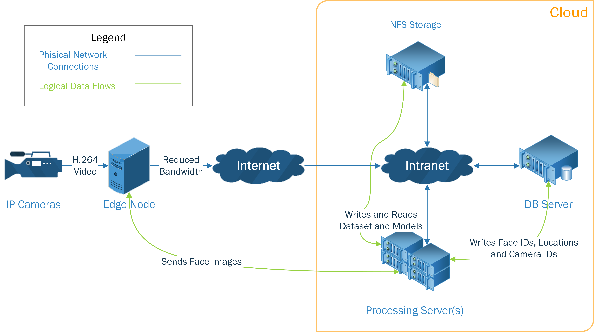
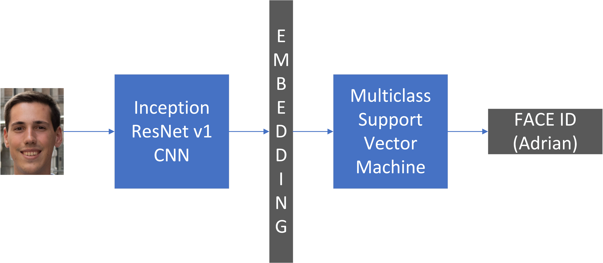

# Kubernetes-Based Face Recognition Framework

This Framework is based on the work of [Arsfutura Face recognition](https://github.com/arsfutura/face-recognition), [David Sandberg FaceNet](https://github.com/davidsandberg/facenet), [Google FaceNet](https://arxiv.org/abs/1503.03832), and [Fyr91 Light face detection model](https://gist.github.com/fyr91/79aaf4b6d679814406ee4028bd03b7aa).

In this project, a facial recognition system for video surveillance systems based on the concepts of machine vision with convolutional neural networks (CNNs), machine learning and distributed computing is proposed, developed and deployed to Azure. The project consists of three parts: the design of an architecture focused on reducing the bandwidth required to transport the images from the cameras to the cloud servers; the design and implementation of the software that compresses the data near the cameras; and the design and implementation of a REST API for image processing easily scalable to large deployments in the cloud.

The reduction of the bandwidth required for the transmission of images from the cameras to the cloud is achieved by pre-processing the data in an intermediate node near their generation through the use of edge computing techniques.

In the pre-processing stage, the faces contained in each of the frames captured by the cameras belonging to that node are identified and extracted.  The new images that only contain the faces are then sent to the cloud, where they are classified among the known people.  By only sending the portions containing faces instead of sending the entirety of the frames, a significant reduction in the required bandwidth is achieved.

At the cloud, a REST API has been designed and implemented in containers handled by a Kubernetes deployment in the Azure cloud.  In these containers, the system that recognizes the faces received from the edge is executed.  The load is distributed among the different containers, whose number can be scaled to suit the workload.  This API not only allows the recognition of people for whom the model has been trained; it can also incorporate people into the dataset, remove people from the dataset, as well as retrain the recognition model to identify people in the new dataset and start using the new model immediately and without any downtime.  All the information extracted in this process is stored in a database that allows its later analysis.

_For installation instructions, please refer to the [Installation](#Installation) section. For demo local programs to use the API, please refer to the [Demo Local Programs](#Demo-Local-Programs) section._

## Installation

The facial recognition system can be installed in a multitude of different platforms. In this sections we go over installing the program locally in a computer for debugging, as well as configuring the system in a cloud environment.

### Cloud provider installation

To install the facial recognition system in a cloud provider (Azure, AWS, GCloud, etc.) you need to create a Kubernetes cluster with the nodes that will be running the API and the facial recognition tasks; you also need a storage database and an NFS server. The NFS server and the database can also be running in the Kubernetes cluster, although this option is only recommended for developing purposes.

#### (Opt) DB running in Kubernetes

In case that you want to create the database hosted in the kubernetes cluster for debugging purposes, you can run teh following commands (bash or powershell), which will create a pod with the pre-configured databaser; and will create a service that will make the database accessible to other pods running in the system.

```sh
kubectl create -f ./kubernetes-deployment-azure/facial-recognition-db-service.yaml
kubectl create -f ./kubernetes-deployment-azure/facial-recognition-db-pod.yaml
```

#### API running in Kubernetes

The first step after the servers and clusters have been created in the cloud provider is to create the kubernetes service. This service will serve as the gateway for the incomming API calls. The service requests a hardware/software Load Balancer to the cloud provider, assigned to an external IP address that is used as the ingress to the service.

From the folder where you have downloaded the git repository, execute the following command (bash or powershell):

```sh
kubectl create -f ./kubernetes-deployment-azure/facial-recognition-service.yaml
```

Note: The service initialization may take up to a few minutes depending on the cloud provider used and the load in their systems.

While the provider is assigning an external IP address to the kubernetes service, the next step is to create the kubernetes deployment that will manage the different pods running the REST API, making sure that the requested number of instances/replicas are running at any given time.

```sh
kubectl create -f ./kubernetes-deployment-azure/facial-recognition-deployment.yaml
```

_Note: The default number of pod replicas can be changed in the "facial-recognition-deployment.yaml" file. By default, it is set to 10 concurrent replicas._

The first time that the facial recognition pod's image is downloaded from the docker hub into a given kubernetes pool, it will require some time, due to its size.

#### Health Check

We can check the health status of the service, deployment and pods by running the following command:

```sh
kubectl get all
```

For more information regarding the status of the pods, deployments, and services, we can use the describe command:

```sh
kubectl describe services
kubectl describe deployments
kubectl describe pods
```

### Local installation with Docker

To install the facial recognition system locally in your computer, you will need to have a docker installation with the kubernetes single-node local cluster option enabled. 

_Note: you may need to increase the maximum memory allowed for the local kubernetes node, as the default may not be enough to run the container when performing training operations._

You will need to run a MariaDB database with the user, password and database name specified in the [Dockerfile](./database/Dockerfile) for the creation of the database container. Afterwards, the newly created database must be populated with the data in the [SQL script](./db-gen/face_recognition_db.sql). The address of the SQL server must be set to the address found in the configuration command in the [app.py](./api/app.py) API Flask APP.

From the folder where you have downloaded the git repository, execute the command below (bash or powershell) to create the kubernetes deployment that will manage the different pods running the REST API, making sure that the requested number of instances/replicas are running at any given time.

```sh
kubectl create -f ./kubernetes-deployment-azure/facial-recognition-deployment.yaml
```

If instead of running a whole deployment you prefer to run a single instance of the application i.e. one pod, use the following command instead:

```sh
kubectl create -f ./kubernetes-deployment-azure/facial-recognition-pod.yaml
```

Afterwards, we can make the application availbale in the local computer by exposing the port of the container, forwarding the port of the application to a port in the computer. In the case of using a deployment, we expose the deployment.

```sh
kubectl expose deployment face-recognition-deployment --type=NodePort --name=expose-deployment-service --port=5000 --target-port=8080
```

In case you have instantiated a single pod, we expose the pod.

```sh
kubectl expose pod face-recognition-pod --type=NodePort --name=expose-deployment-service --port=5000 --target-port=8080
```

You can check the status of the services, pods and deployments running on the kubernetes "cluster" by running the commands in the [Health Check](#health-check) section.

## Usage

Once the framework and all the required components have been installed, the system has to be trained to recognize the faces of the people on which it is going to be used. For this task, it is necessary to provide information regarding their facial characteristics. This is done by providing labeled face images of each of the individual persons to the system. For this task, two programs have been designed: one that allows to add a person from images stored in files, and one that allows to add a person via a webcam that captures the images of the person.

### Adding people from files/dataset

The [program to add people from pre-existent images](./interaction-with-framework/add-user-from-dataset) allows us to add a new person to the system by providing a series of images which we already have available. These images must also be accompanied of a label provided by the user, which will be used to uniquely identify the person by the system e.g. the name of the person, or a company ID.

The input arguments of the program are:
-	Input-folder: Points to the address of the directory with the images to be uploaded.
-	Person-ID: Name of the Face ID to which the images are to be added.
-	IP-address: The Cloud API ingress IP address (points to the Load Balancer).
-	Create-ID: If present in the command, indicates that the program must sent a Face ID creation request prior to sending the images.
-	Train: If present in the command, indicates that the program must send an Optimized train request to the Cloud API once the ID has been created and the images have been added.

In the following example command, we are adding a person identified by his name (Bill Gates). This is done by providing a series of images stored in the computer, providing the IP address of the API, the desired ID, and instructing the program to request the creation of the ID to the cloud API, as well as requesting a system training after the person has been added with all its images.

```sh
python add-user-from-dataset.py --ip-address {API's IP address} --input-folder C:\Users\user\Desktop\Face_Recognition_Project\Datasets\lfw\Bill_Gates --person-id "Bill Gates" --create-id --train
```

_Note: sending the training request with the ```--train``` argument is only necessary when we want the system to apply all the changes and start recognizing the new people. This means that multiple people can be added and train only on the last one._

### Adding people with a webcam

The [program to add people with a webcam](./interaction-with-framework/add-user-with-camera) allows us to add a new person to the system by using a camera to capture a series of pictures of the person. This images are then sent to the cloud server with a label provided by the user, which will be used to uniquely identify the person by the system e.g. the name of the person, or a company ID.

The input arguments of the program are:
-	Person-ID: Name of the Face ID to which the images are to be added.
-	IP-address: The Cloud API ingress IP address (the address points to the Load Balancer).
-	Img-number: the number of face images to be taken, pre-processed and sent to the Cloud API to add them to the Face ID.
-	Create-ID: If present in the command, indicates that the program must sent a Face ID creation request prior to sending the images.
-	Train: If present in the command, indicates that the program must send an Optimized train request to the cloud API once the ID has been created and the images have been added.

In the following example command, we are adding a person identified by his name (Cristobal Colón). We ask the program to obtain 20 images from the camera, providing the IP address of the API, the desired ID, and instructing the program to request the creation of the ID to the cloud API, as well as requesting a system training after the person has been added with all its images.

```sh
python add-user-with-camera.py --person-id "Cristobal Colon"  --ip-address {API's IP address} --img-number 20 --create-id --train
```

_Note: sending the training request with the ```--train``` argument is only necessary when we want the system to apply all the changes and start recognizing the new people. This means that multiple people can be added and train only on the last one._

### Real-time camera

After or even while the desired people have been added to the system, we can use the [program to recognize faces from the camera](./interaction-with-framework/real-time-camera) to recognize the people in the images from the main webcam connected to the computer running the program.

The input arguments of the program are:
-	IP-address: The Cloud API ingress IP address (the address points to the Load Balancer).
-	Min-size: Minimum face image size on the long axis. Smaller images are discarded.
-	Max-size: Maximum face image size on the long axis. Larger images are resized.
-	Min-confidence: Minimum confidence level to show result of face recognition.
-	Multithreading: Send all face images in a frame simultaneously to the Cloud API (improves performance, looses verbosity).

To run it, we only need to provide the IP address where the API we have previously installed can be found. An example command can be found below, where the program is configured to recognize the images usin the API in provided IP address, and only showing the identity of the faces detected for which the confidence of the match is over 80%. 

```sh
python real-time-camera.py --ip-address {API's IP address} --min-confidence 0.8
```

### Other Programs

There are many other programs appart from the ones discussed in the previous subsections, with which the functionality of the framework can be tested, benchmarked and showcased. These programs can be found in the [interaction-with-framework](./interaction-with-framework) folder.


## Architecture

The differentiating factor of this architecture is that it allows to divide the face recognition workload between local (edge) and remote (cloud) processing, reducing the amount of data that needs to be sent between the two through the network. This is achieved by extracting the faces in the edge processing, and sending a cropped image to the cloud. These face candidates then go throug another face recognition process in the cloud.



The face recognition running on the edge is optimized for low processing power (as well as to run in any type of platform without special requirements), while the face recogntion running on the cloud is optimized for accuracy. The edge video process for face image extraction is shown below.


The second face extraction process (performed in the cloud) is necessary, as some of the face candidates sent by the edge face extraction process may be false positives. This is solved as seen below.


Once the face image has been recognized and re-extracted by the cloud, it undergoes a process based on the Google FaceNet face image processing and matching architecture, as shown below. This architecture uses the Inception ResNet v1 CNN to process the face image and obtain a 128-dimension vector (embedding) that uniquely identifies the image characteristics. This vector is then fed to a Multiclass Support Vector Machine that has been previously trained to classify the embeddings into a number of known identities.



## API Calls

For a documentation regarding the API calls available in the API, please refer to the Swagger documentation available on the {API's IP address}:{API's Assigned Port}/docs URL. The IP address depends on the installation (localhost if installed in docker). The port is 80 for the cloud deployment yaml configurations used in the [cloud deployment installation instructions](#cloud-provider-installation), and 8080 for the [local installation instructions](#local-installation-with-docker).

## Contributing

If you are interested in contributing to this project, please contact me (@CMompo) so that we can chat over what can be improved and what needs fixing. Feel free to use the code in this project, taking into account the licensing (basically you have to mention me (Adrian Mompo) and Arsfutura in any derivate work). Also, feel free to copy the license if you want to.

For more information, please refer to the complete documentation for the Master's Thesis at [RiuNet](https://riunet.upv.es/handle/10251/152367). Note that this documentation in that link only covers changes made until August 2020. Posterior changes will be reflected in the documentation available here.
